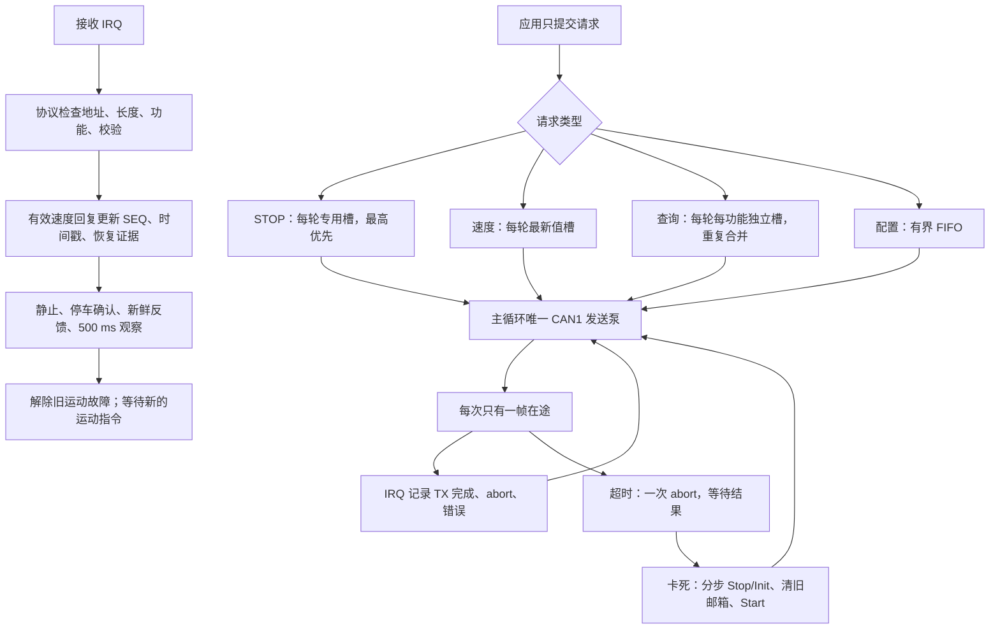

# CAN1 两批重构与验证记录

2026-09-26：两批代码改动、各批软件复现测试和 ARM 固件构建已完成。本文保留当时实现与验证结果。**2026-09-27 根据复位后的新日志继续修正，当前恢复条件、轮询周期和固件路径以 [复位后通信修正记录](can1-reset-recovery-2026-09-27.md) 为准。** 没有由本任务烧录、连接调试器或操作电机。重构前的分析和现场日志证据见 [原始审查记录](can1-logic-and-stability-plan-2026-09-26.md)。

## 问题与改动结果

`READY=0` 有两种需要区分的情况：控制器当前不健康，或运动故障仍被锁存。`AGE_MS` 一直增长表示该电机没有被协议层接受的新速度回复；发送入队成功、CAN TXOK、收到其他帧都不能代替这个回复。

原日志中 TX_OK/RX 和四轮 SEQ 固定，TX_QUEUED/TX_ABORT/TX_TIMEOUT 增长，且 ESR 存在错误被动状态。这说明当时实际收发已停止，不能只靠放宽 READY 判据处理。另一份探测日志 VALID=0、SEQ=0 表示从未接受速度回复，此时 AGE 接近开机时长，不代表某次回复之后开始失联。

此次处理了查询与运动共用队列造成的误锁存、恢复附加条件阻断、固定扫描使 motor 4 饥饿、异步 abort 的生命周期、停车重试反复取消查询，以及链路停滞时等待新反馈才能修复的循环依赖。

| 复现/故障注入 | 第一批结果 | 第二批结果 |
| --- | --- | --- |
| 连续重复 0x35/0x3A，普通队列被查询填满 | 不再复现，独立查询槽合并 | 通过 |
| 查询等待/邮箱超时导致全局运动锁存 | 不再复现；真实反馈超时仍有效 | 通过 |
| REC=18、历史 PARAM 阻断健康链路恢复 | 不再复现；仍需停车、新回复和观察窗口 | 通过 |
| ACK、非法帧伪造 AGE 新鲜度 | 保持拒绝 | 通过 |
| 20 ms 服务周期、前三轮不断更新导致 motor 4 饥饿 | 仍可复现，保留给第二批 | 不再复现 |
| 异步 abort 与停车重试取消在途 STOP/查询 | 第二批处理 | 通过 |
| F3 使能完成前速度抢发，或一个轮等待阻塞其他轮 | 第二批处理 | 通过；5 ms 从 TXOK 起算 |
| 查询回复超时从入队起算、RX 先于 TX 回调 | 第二批处理 | 通过；从 TXOK 起算并处理回调时序 |
| Stop/Start/通知开启失败，被当成恢复成功 | 第二批处理 | 通过；保留故障，500 ms 间隔重试 |
| 30 s 四轮控制、查询和反复停车 | 第二批处理 | READY 保持，最大 AGE=43 ms，各轮 SEQ 增长 |
| 发送冻结 600 ms 后恢复 | 第二批处理 | 反馈按时过期，停车及新回复后恢复，旧非零速度不重发 |

表中“通过”和 AGE=43 ms 都是 HAL 模拟结果。测试按 1 ms 发送泵、10 ms 一个速度查询、20 ms 控制更新及模拟回复执行，不能替代真实电机响应时间测量。

## 第一批：查询隔离和恢复证据

0x35/0x3A 按“电机 × 功能码”使用八个查询槽，相同待处理查询合并。查询队列等待或邮箱超时只记诊断，不直接触发运动故障；反馈过期仍由运动层独立判断。恢复取消 TEC/REC 必须为零和历史 PARAM 的额外限制，改用当前控制器健康状态以及所需轮的有效速度回复，保留 500 ms 观察、停车确认和 300 ms 反馈门槛。

启动时先初始化协议对象和回调，再启动 CAN 接收。未 HOST LINK 时可读取 `CAN STATUS`。增加故障来源、查询发送完成、有效速度回复和协议拒绝计数。

第一批完成后，六套主机 C 测试、真实 HAL 头文件语法检查和 46 单元 ARM 编译/链接通过。专项测试确认查询积压和 REC/PARAM 恢复阻断不再复现，同时明确复现 motor 4 饥饿，进入第二批。

最终路由复查发现新增 `CAN STATUS` 白名单同时误改了 HELP 分支，导致诊断被提前截获。已修正生产代码与第一批检查点，补充三项源代码契约检查，并重新运行第一批控制层/专项测试及全部 46 单元构建。修正后的第一批结果仍保持上表结论。

检查点源码、复现输出和构建结果位于 `tmp/can-wave1/`；完整构建源码快照为 `tmp/can-wave1/source/`，ELF 为 `tmp/can-wave1/firmware/serialPlotTest.elf`。该 ELF 是第一批对照版本，不用于替代最终固件。

## 第二批：最终通信流程



### 调度与发送

所有发送 API 只入队，由 `ZDT_CAN_Process()` 唯一调用 `HAL_CAN_AddTxMessage()`。返回 0 表示请求已接收，不能解释为已上总线或电机已执行。

停车有独立四槽，绝对优先；配置、速度、查询三类轮换服务，速度和查询在类内按电机轮换。每次最多一帧在途，HAL 可以选择任意空物理邮箱。这减少三邮箱之间的共享状态，正常主循环服务速率仍足以覆盖当前轮询和控制负载。连续停车期间速度会被清除，查询保留；STOP 发完后继续服务查询。

速度更新替换未发送的旧目标值，但不重置首次等待时间。四个速度槽均检查等待期限，避免某个轮一直被遗漏却没有报警。F3 在 FIFO 中时对应轮速度不能抢发；F3 真正 TXOK 后等待 5 ms，其他轮仍可发送。

### 反馈新鲜度

应用每 10 ms 查询一个选中的轮；四轮模式名义查询周期 40 ms，部分电机掩码直接跳过未选轮，不浪费本次轮询机会。

查询 TXOK 后才进入等待回复；收到有效 0x35/0x3A 后结束等待。若回复 IRQ 先于主循环消费 TXOK，使用回复计数增量识别已经收到的回复。未收到回复超过 80 ms 后，经过 40 ms 退避允许下一次轮询重试。查询仍由应用周期触发，传输层不会无限自行重发。

`AGE_MS` 仅在有效速度回复时归零：地址 1..4、扩展 ID 包索引为 0、速度回复长度 5、方向合法、尾字节 0x6B。状态回复、F6/F3 ACK、无效帧和单纯 RX 计数增长都不刷新速度反馈。无回复时 AGE 应继续增长，不能通过改时间戳掩盖失联。

### 停车与恢复

首次停车清除旧运动请求，并对需要抢占的在途帧请求一次 abort。之后 100 ms 停车重试只补零速度请求，不再取消正在发送的 STOP 或查询，保留 F3 请求。停车被实际反馈确认且没有待发 STOP 后结束停车事务。

TX 超时 50 ms 后请求一次 abort；等待完成/取消 IRQ，不提前释放软件跟踪状态。abort 10 ms 内没有结果且不处于 BOFF 时，进入分步链路修复；未知占用邮箱也有 150 ms 停滞监督。

修复不依赖新反馈：进入 Stop/Init，检查并取消遗留硬件邮箱，确认邮箱为空后 Start 并重新开启 CAN1 通知。每个主循环推进一个有界步骤，失败至少间隔 500 ms 再试。HAL 的 Start/Stop/Init 在恢复中运行时保留中断，以免禁用 SysTick 导致其等待超时无法结束。BOFF 时保留既有 ABOM 机制，不循环重启控制器。修复不做 RCC 复位，不更改 CAN2 或共享过滤器配置。

链路修复成功也不直接授权运动。解除锁存只走一个入口，要求当前 HAL/ESR 健康、无活动运动、所需轮反馈新鲜、停车已确认、没有待发 STOP，连续观察至少 500 ms，并在该窗口内出现发送完成与每个所需轮至少两条新的有效速度回复。新故障、掩码变化或条件中断会重开观察窗口。解锁前清掉旧运动目标，必须重新收到运动指令才能运行。

当前健康判据仍检查 LISTENING、阻断类 HAL 错误和 ESR 的 EWGF/EPVF/BOFF。TEC/REC 本身不要求为零；历史 ACK/PARAM 等保留为诊断。安全阈值保持反馈 300 ms、停车确认 600 ms 及两次新零速样本。

## 诊断字段

`CAN STATUS` 保留原字段，并在原来的最终 `# CAN ESR=...` 行之前增加两行，兼容上位机以 ESR 行结束该响应的读取方式。

| 字段 | 用途 |
| --- | --- |
| READY / HW_READY / TX_FAULT | 综合就绪状态、控制器当前状态、运动故障锁存 |
| REASON / FAULT_AT_MS | 当前故障累计原因位及最近一次故障时间 |
| Q_MERGED / Q_EXPIRED / Q_TIMEOUT | 重复查询合并、队列过期、发送或回复超时累计 |
| RX_REJECT | HAL 收到但协议/帧格式不合法的累计帧数 |
| QUERY TX_OK 四项 | 每轮查询真正发上总线的累计次数，包含速度/状态查询 |
| SPEED_REPLY 四项 | 每轮有效速度回复累计次数，可与 SEQ/AGE 交叉检查 |
| REPAIR | 0=无修复；1=Stop/Init；2=清旧邮箱；3=Start/通知 |
| FLIGHT | 0=空闲；1=等待发送结果；2=等待 abort 结果 |
| REC_PHASE | 0=无故障；1=故障/条件未满足；2=观察恢复证据 |
| AUTO_REC | 兼容旧字段，保持 0；不再有另一条自动运动解锁通路 |

REASON 位：0x01 上层外部故障，0x02 普通队列溢出，0x04 HAL 提交/控制器操作，0x08 可靠请求等待或发送超时，0x10 当前 ESR 错误被动/BOFF，0x20 链路/abort 停滞，0x40 反馈不新鲜，0x80 非有限运动输入。原因可按位组合。

排查 AGE 时依次看：查询 TX_OK 是否增长 → RX 是否增长 → SPEED_REPLY/SEQ 是否增长。查询不发看 FLIGHT/REPAIR/TX_TIMEOUT；有 RX 但无有效速度回复看 RX_REJECT 与协议选择；HW_READY=1 但 READY=0 看 REASON、STOP 状态和恢复窗口的新回复增量。

## 验证与产物

- 最终六套 portable C 测试全部通过，包含 14 组控制层测试、12 组 CAN 传输专项场景。
- 三项 CAN STATUS 源代码契约检查通过：不会被其他分支截获、未链接可查询、ESR 仍为响应最后一行。它们不是整机命令执行测试。
- 上位机 `llm-pid-tuner-main` 158 项、`pi-brain` 194 项 Python 测试通过，共 352 项。
- ARM GCC 13.3 以真实 HAL/CMSIS、`-Wall -Werror` 编译全部 46 单元并链接成功。最终 ELF：text=110908、data=516、bss=29652 字节。
- 第一批 ELF：text=108708、data=516、bss=29436 字节；两批各自构建日志保留。

主要源码：`Core/Src/zdtCan.c`、`Core/Inc/zdtCan.h`、`Core/Src/zdtEmm.c`、`Core/Src/mecanum_chassis.c`、`Core/Src/robot_app.c`。验证入口为 `tests/c/test_can_transport.c`、`tests/c/test_control_layer.c`、`tools/test_can_status_routing.py`。

```powershell
python tools/run_c_tests.py --cc E:/mingw64/bin/gcc.exe
python tools/build_firmware.py --toolchain-bin E:/STMCubeIDE/STM32CubeIDE_1.19.0/STM32CubeIDE/plugins/com.st.stm32cube.ide.mcu.externaltools.gnu-tools-for-stm32.13.3.rel1.win32_1.0.0.202411081344/tools/bin --output tmp/can-wave2/firmware
# 第一批修正后的独立源码检查点复现与构建
python tmp/can-wave1/verify_checkpoint.py
```

第二批最终源码副本、测试输出在 `tmp/can-wave2/`；最终固件在 `tmp/can-wave2/firmware/serialPlotTest.elf`。tmp 为本地忽略产物，长期复现依赖仓库中的源码与测试；第一批检查点脚本仅用于本次本地对照。

## 实机复测尚未执行

烧录最终第二批固件后，先在静止状态连续采集至少 30 s 的 `CAN STATUS`、`MOTOR FEEDBACK`、`MOTOR STOP STATUS` 和主循环监控，再在受控条件下重复开始/停车。合格表现是各所需轮 SEQ/SPEED_REPLY 持续增长、AGE 周期回落且低于 300 ms；正常场景不累积发送超时/链路修复；停车确认后恢复窗口能完成。

若重现 READY=0 或 AGE 持续增长，保留故障前后日志，按上述三段计数区分查询未发、无回包、协议未接受。主循环长时间阻塞、真实控制器的 abort/初始化行为以及驱动实际回复速度仍需硬件确认；不能将本轮模拟测试写成实机问题已消除。
