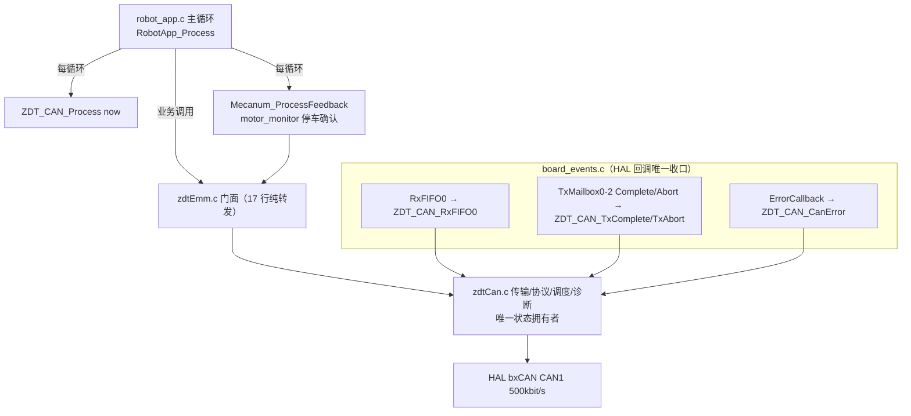
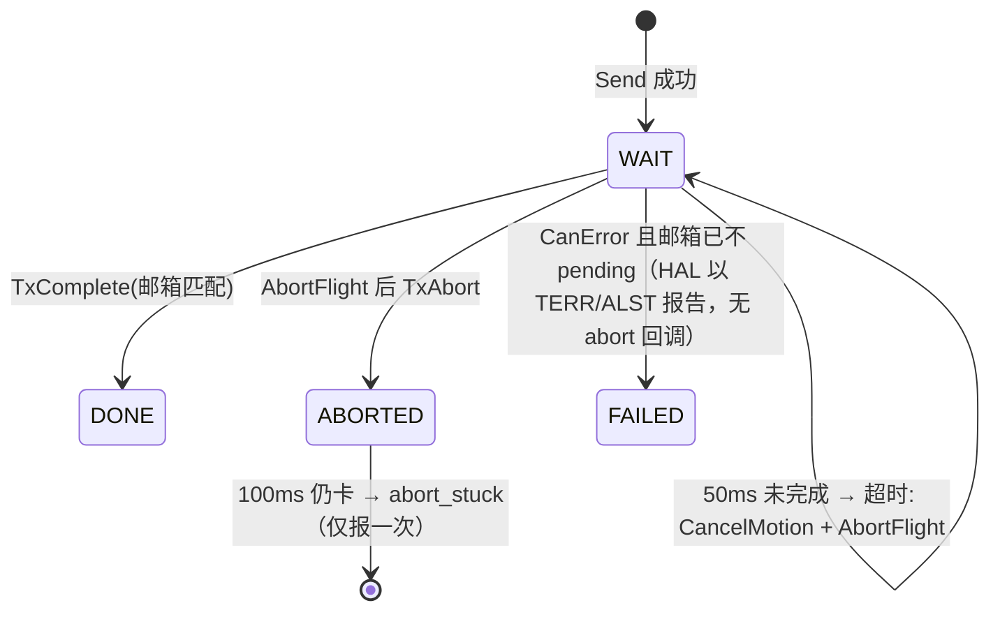
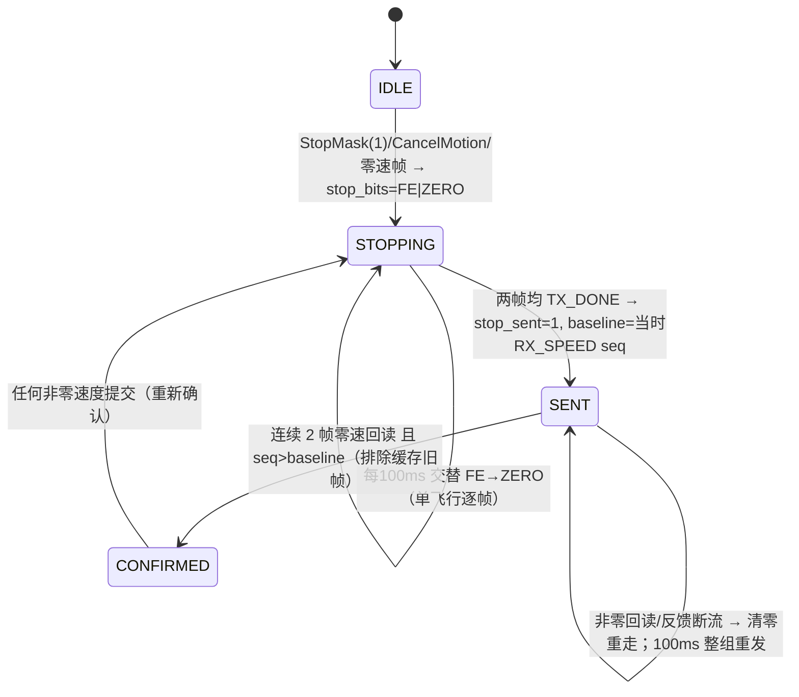

# CAN1 通信逻辑与结构审查（批次1：ID1 台架）

> 审查对象：工作树未提交版本（2026-09-09）。
> 演进关系：39ec12c（四轮直发）→ e9c567e（PendingCan 队列 + BeginStop/SendStop，547 行）
> → **当前 WIP（450 行，单飞行 ID1 台架后端，四轮后端封闭）**。
> WIP 相比 e9c567e 净删约 600 行（zdtCan -953/+、robot_app -521/+、zdtEmm -244/+），
> 是对队列方案的推倒重写。本文描述并审查**当前工作树实况**；`git status` 中
> zdtCan/zdtEmm/mecanum_chassis/robot_app 四文件为未提交状态。

---

## 1. 当前状态一句话

**CAN1 上只有 ID1 电机被支持**（`ZDT_CAN1_TEST_ID=1`），作为台架诊断/单电机运动后端；
四轮底盘后端**刻意封闭**（`ZDT_CAN_IsAvailable()` 恒 0），上层四轮命令被明确拒绝
（`# ERROR CAN1 STAGE1 CHASSIS NOT RELEASED`）。这是分批放行策略：先把单电机链路的
完整性、停车确认与诊断做扎实，再泛化到四轮。

## 2. 分层结构

- **zdtEmm.c 已退化为 17 行纯门面**（`ZDT_Emm_*` → `ZDT_CAN_*`），应用层 API 名不变，
  调用点（robot_app/mecanum_chassis/llm_tuner）无需感知批次切换。
- **zdtCan.c 是 CAN1 状态/调度/RX/TX/诊断的唯一拥有者**；头文件明示
  "no legacy queue/restart logic"。
- **ISR 只做捕获**（原始帧入快照槽、传输结果、错误锁存），无 printf、无业务；
  便携主机测试经 `CONTROL_HOST_TEST` + `control_test_hal.h` 直接喂 `ZDT_CAN_Process/FeedByte`
  等价序列（tests/c/ 五套件覆盖）。

## 3. 物理层与外设配置（can.c + InitAll）

| 项 | 值 | 说明 |
|---|---|---|
| 位速率 | PCLK1 42MHz ÷ 14 ÷ (1+4+1)tq = **500 kbit/s**，采样点 83.3% | SJW=1TQ |
| ABOM | ENABLE | BUS_OFF 硬件自动恢复；代码把恢复当"证据"计数，不当 READY |
| 自动重传 | ENABLE | 配合单飞行 50ms deadline：总线持续忙时由软件 Abort 兜底 |
| 过滤器 | bank0，32 位掩码：`FilterIdLow=4, MaskIdLow=6` | 只要求 IDE=1、RTR=0，**接受任意扩展数据帧**；ID 过滤交给 RX 校验 |
| 中断 | RX_FIFO0_PENDING + OVERRUN + TX_MAILBOX_EMPTY + ERROR/WARNING/PASSIVE/BUSOFF | **LEC 中断故意不开**（HAL 会在回调前清 LEC），主循环直接读 live ESR |
| ExtId 约定 | `motor_id << 8`；末字节校验 `0x6B` | X42S EMM 手册 V1.0.2 |

## 4. 帧协议（TX 命令 / RX 判定）

| 帧 | 方向 | 内容 | 触发 |
|---|---|---|---|
| `0xF6` 速度 | TX→RX ACK | dir(1B) + 幅值(2B)，RPM；`options&0x80`（S_Vel_IS）时幅值×10 | 闭环/停车/调试 |
| `0x35` 读速度 | TX→RX(5B) | 幅值 ≤5000，符号位 | 20ms 轮询 |
| `0x3A` 读状态 | TX→RX(3B) | bit0=使能 | 100ms + 使能后即查 |
| `0x1A` 读选项 | TX→RX(3B) | bit1=EMM 校验通过，bit0x80=命令×10 | 1000ms |
| `0xF3 AB` 使能 | TX→RX ACK(3B) | enable 0/1 | 仅 `stop_confirmed && !stop_bits` 时允许使能 |
| `0xFE 98` 停车(FE) | TX→RX ACK(3B) | 多圈相关停车帧（语义见手册 pp.40-41,48,67） | 停车序列第一步 |

RX 槽位分类（ISR 内，**每中断最多处理 3 帧**）：严格校验 IDE/RTR/ExtId/DLC(2..8)/
末字节 0x6B/数值范围 → `RX_SPEED / RX_STATUS / RX_OPTIONS / RX_ACK` 四个
**最新值快照槽**（`sequence++`，主循环用 `sequence != consumed` 检测被覆盖的旧值，
计 `rx_overwritten`）；ACK 槽特判：`2=ACK`，`0xE2/0xEE=NACK → irq_nack 紧急锁存`。

## 5. TX 单飞行模型（本设计核心）

`Send()`（PRIMASK 临界区内完成全部动作）：

1. `flight.active || 邮箱全满` → `BUSY`（**同时只允许一帧在途**）；
2. `HAL_CAN_AddTxMessage` 之后、**同一临界区内**发布 `flight`（mailbox/tick/code/active）——
   消除"完成中断早于所有权发布"的竞态；
3. 结果码五态：SUBMITTED / BUSY / CAN_ERROR / INVALID / UNAVAILABLE（上层可判别）。

`Flight` 生命周期（`ConsumeFlight` 每循环推进）：

- 非零速度帧完成耗时 ≥50ms 也按 TX_TIMEOUT 取消（完成不等于及时）；
- 非 zero 速度提交会清 `stop_sent/stop_confirmed`——任何运动都使停车状态机重新走一遍。

## 6. 周期调度器（ZDT_CAN_Process 内，防饿死设计）

| 流量 | 周期 | 说明 |
|---|---|---|
| 速度轮询 0x35 | 20ms | `POLL_MS`；**让位规则**：若上一提交是 poll 且 stop/options/status 到期，则本轮让位（慢速合法 TX 不会饿死停车） |
| 停车重试 | 100ms | `stop_bits` 非零时交替发 FE/ZERO；`stop_sent && !stop_confirmed` 时整组重发（覆盖电机晚上电） |
| 状态 0x3A | 100ms | — |
| 选项 0x1A | 1000ms | — |

跳过条件：`flight.active || BOFF` 期间不发起任何新 TX。

## 7. 停车状态机（安全核心）

- `stop_confirmed` 是**使能（0xF3）和非零速度**的前置条件——"发过零速"升级为
  "回读到两次零速"；
- 停车请求同时**中止在途非零帧**（`flight.cancelled + AbortFlight`）。

## 8. 故障检测与取消矩阵（CancelMotion(reason) → StopMask）

| 触发 | 检测点 | 阈值 |
|---|---|---|
| TX_FAILED | AddTx 失败 / CanError 报告完成失败 | 立即 |
| TX_TIMEOUT | flight 50ms 未完成；或完成耗时≥50ms（非零帧） | 50ms |
| FEEDBACK_GAP | 相邻速度回读间隔 >60ms（前值 valid 时） | 60ms |
| MOTOR_NACK | ACK 槽 0xE2/0xEE（urgent，不被后续 ACK 覆盖） | 立即 |
| ERROR_PASSIVE / WARNING | ESR EPVF/EWGF（live+锁存） | 立即 |
| BUS_OFF | ESR BOFF；ABOM 自恢复计 `auto_bus_off_exits`，不当 READY | 立即 |
| STATUS 禁用 | status bit0==0 | 立即 |
| 反馈断流 | ReadyByID 失败（速度帧龄 >60ms 或状态失效） | 立即 |
| RX overrun | FIFO0 溢出 | 计数 |

## 9. 就绪门禁与上层集成

`ZDT_CAN_ReadyByID(ID1)` = `Healthy()`（started + LISTENING + ESR 无 EWGF/EPVF/BOFF）
+ EMM 协议 + `options` 校验位（≤2s 新鲜）+ 状态使能（≤300ms）+ 速度反馈有效（≤60ms）。

上层联动（全部已按批次1收敛）：

- `HostLink_SetChassisEnabled`：`!ZDT_Emm_IsAvailable()` → `chassis_motors_enabled=0` 直接返回；
- `SetAllMotorsSpeed`：UNAVAILABLE 直接返回；mask 内电机反馈未就绪 → 停车并返回；
  **任一轮提交失败 → 立即 StopAllMotors 撤销已提交轮**（"部分下发"防御）；
- `ChassisSafety_Process`：单电机运动要求 `ZDT_CAN_ReadyByID(debug_motor_id)`；
  其余运动要求 `ZDT_Emm_IsAvailable()`（现恒 0 → `CAN1 NOT READY OR COMMAND CANCELLED`）；
  新增停车原因 **MOTOR FEEDBACK LOST**（required_mask 内任一轮反馈断流）；
- ASCII：`POSE SET / MOVE / TURN` 在后端封闭时直接拒绝；`MOTOR RUN` 仍可用于 ID1 台架
  （豁免 OPS）；
- 诊断命令：`CAN STATUS`（Can1_PrintStatus 全量 stats）、`MOTOR STOP STATE`（monitor 状态机）、
  `MOTOR FEEDBACK`（逐轮 rpm/age/seq）。

## 10. 审查发现

### 10.1 设计优点

1. **单飞行 + 所有权发布次序正确**：AddTxMessage 与 flight 发布同在 PRIMASK 临界区，
   完成中断不可能抢在所有权之前到达。
2. **"TXOK ≠ 已停车"**：停车确认要求两帧零速**回读**且 sequence 晚于停车帧完成点
   （排除邮箱里缓存的旧回复），并以 100ms 整组重发覆盖电机晚上电场景。
3. **NACK 紧急锁存**：运动拒绝 ACK 不会被后续正常 ACK 覆盖，立即 CancelMotion。
4. **RX 全量校验 + 覆盖检测**：ID/DLC/校验字节/数值范围四层过滤；`rx_overwritten`
   让"主循环来不及消费"变得可观测。
5. **诊断面完整**：rtt/gap/age 分位数、TEC/REC 峰值、abort_stuck、bus_off 进出计数、
   停车三时刻（requested/sent/confirmed）——现场未解故障全部有观测点。
6. **可移植测试**：传输层经 `CONTROL_HOST_TEST` 在主机重放 ISR/主循环序列，
   五套件回归不依赖硬件。

### 10.2 风险与问题（按批次影响排序）

| # | 级别 | 问题 | 说明 |
|---|---|---|---|
| 1 | **批次2 阻塞** | ID1 硬编码贯穿全文件：`Selected()`、`ReadyByID`、`feedback[]` 实际只维护下标 0、`ConsumeReplies` 只认 `ExtId==1<<8`、`StopMask` 只对 `mask==0x01` 返回 SUBMITTED | 放行四轮前必须泛化（见 §11 迁移清单） |
| 2 | **批次2 阻塞（安全）** | `StopMask` 对 `mask!=0x01` 返回 UNAVAILABLE **且不置 stop_bits**；`StopPending` 对非纯 ID1 mask 恒 1 | 后果：四轮 mask=0x0F 时 `SetAllMotorsSpeed` 的部分下发撤销**失效**（StopAllMotors 不产生任何停车状态），且 MotorStop monitor 永远到不了 CONFIRMED。批次1（mask=0x01）不受影响，但批次2 前必须改为逐电机 stop 状态机 |
| 3 | 低 | 60ms FEEDBACK_GAP 门槛与单飞行 50ms deadline 接近：一次贴着 deadline 的长帧 + 让位规则可能造成偶发误 cancel（方向安全，但会打断台架运动） | 观察 `stats.wheel[0].gap_max`；批次2 队列化后重新评估 |
| 4 | 低 | `ZDT_CAN_CanError` 在 ISR 内调用 `HAL_CAN_ResetError`（清 HAL 软件错误字段） | 注释已说明意图；升级 HAL 版本时需回归此项 |
| 5 | 信息 | 过滤器放行所有扩展帧，ID 过滤靠软件 | 总线上出现其他节点时 `rx_rejected` 上升 + ISR 预算 3 帧可能不够，批次2 建议改硬件过滤 ID |
| 6 | 信息 | `TestReset` 仅供主机测试；`sequence` 差值 `copy.sequence - stop_baseline` 依赖单调整数 | 复位路径已同步清 stop 状态，风险可控 |

### 10.3 已记录的未解故障（历史现场）

e9c567e 提交信息与代码注释记录了队列方案的现场故障：**"FREE=0 的卡死计时永远到不了
150ms，STALL_REC 将一直为 0（现场已复现）"**——即邮箱长期无空闲时，基于计时的
卡死检测失效。当前 WIP 用单飞行 + 50ms deadline + AbortFlight 的方式**从结构上移除了
该故障的前提**（不再有排队），但该故障在 e9c567e 版本上仍未解；若需回溯，见
`git show e9c567e:Core/Src/zdtCan.c` 的 BeginStop 注释。

## 11. 批次2（四轮）迁移清单

1. **RX 按发送方分槽**：帧内无电机号，靠 `ExtId = sender<<8` 区分——`RxFIFO0` 的
   ID 校验需改为接受 1..4 并按 id 写入各自槽位（options/status 也需 per-id）。
2. **StopMask/StopPending 逐电机状态机**（风险 #2 的修复前提）：每电机独立的
   stop_bits/sent/confirmed/baseline。
3. **调度器多轮轮转**：20ms×4 轮询在 500kbit/s 上带宽可行（每帧 ~110µs），
   但单飞行模型下 4 次 0x35 查询需 80ms 或改回队列——需重新权衡 deadline 与
   FEEDBACK_GAP 门槛。
4. `Selected()`/`ReadyByID` 泛化；`ZDT_CAN_IsAvailable()` 放行条件定义
   （建议：至少 N 个电机 ReadyByID）。
5. `Mecanum_SetRequiredMotorMask(0x0F)` 语义重测：部分下发撤销、MOTOR FEEDBACK LOST
   的 mask 逻辑、MotorStop monitor 在四轮下全链路回归（tests/c 便携用例同步扩展）。
6. `HostLink_SetChassisEnabled` 循环使能 1..4 与 zdtCan 使能 5ms 间隔的配合确认。

## 12. 结论

批次1 的单飞行重构方向正确：用"更少的状态 + 更严的确认"替换了存在现场故障的
队列方案，停车从"命令发出"闭环到"零速回读"，诊断面足以支撑当前未解故障的观测。
主要代价是四轮能力暂时封闭——这是合理的分批策略。**放行批次2 前必须先解决
风险 #1/#2（逐电机泛化与停车状态机）**，否则现有部分下发撤销会静默失效。
